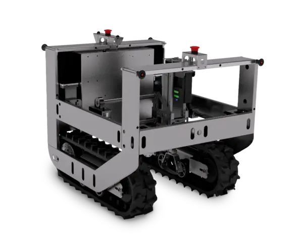

# Zauberzeug Field Friend

This is an example implementation of an mechanical weeding robot with [RoSys](https://rosys.io).
The full [Field Friend](http://feldfreund.de) system is build by [Zauberzeug](http://zauberzeug.com) as a development platform to advance organic and regenerative agriculture.



## Features

- full control via web interface
- 3D visualization of the robot and it's detected surrounding
- manual steering with touch-joystick and keyboard
- camera/motor calibration for real world coordinate system (unit: meters)
- ...

## Getting Started

```bash
git clone git@github.com:zauberzeug/field_friend.git
cd field_friend
python3 -m pip install -r requirements.txt
./main.py
```

This will start the simulated robot and open the user interface in your browser.

## On Real Hardware

### Development

The following instructions will only work if you have a real "Zauberzeug Field Friend" at your disposal.
Contact [sales@zauberzeug.com](mailto:sales@zauberzeug.com) if you are interested in a non-profit purchase of this development hardware.

1. make sure you can login via ssh without providing a password (via `ssh-copy-id` command)
2. go to your local `field_friend` folder and start the LiveSync script: <br>
   `./sync.py <ssh-host-name-of-field-friend>`
3. this will deploy your local code to the Field Friend
4. as long as [LiveSync](https://github.com/zauberzeug/livesync) is active, all code change are automatically pushed to the machine
5. the new code will automatically trigger a reload on the Field Friend

### Update RoSys and NiceGUI

To utilize personal versions of RoSys and NiceGUI instead of the default ones provided in the docker image,
modify the docker-compose.yml file by uncommenting the volume mounts. Then execute the following commands:

```bash
cd ~/field_friend
./docker.sh u rosys
```

### Debugging

You can see the current log with

```bash
./docker.sh l rosys
```
